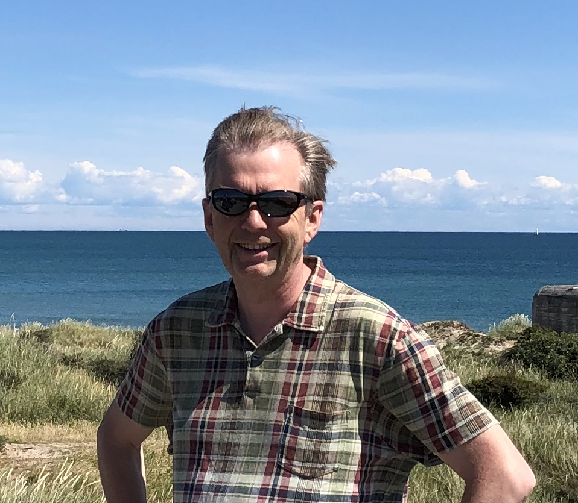

# Project Team

This is content

Gunnar supervises the Icelandic component of the OpenEdu project, in particular the linking and format consistency with the tutor-web.

Gunnar is a Professor of Statistics at the University of Iceland, Department of Mathematics.
