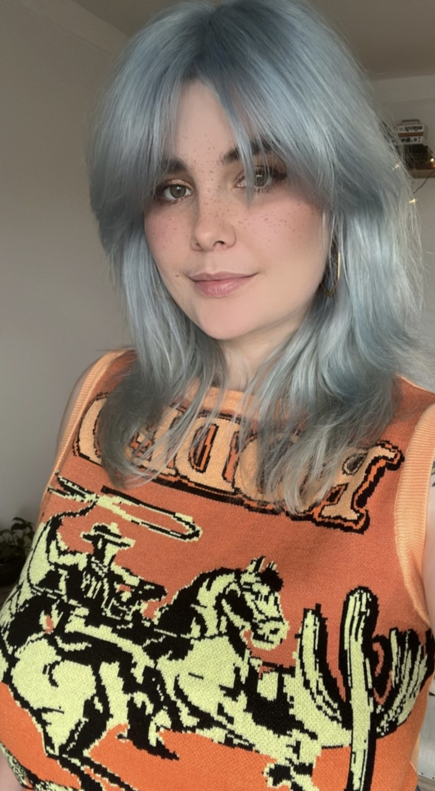

# Project Team

## Hulda Hvönn Kristinsdóttir

Hi!
I'm Hulda.
I have a Bachelors degree in Mathematics and Mathematical Education and a Masters degree in Upper Secondary Education of Mathematics.
My role in the OpenEdu project is to review the content of the Computing and Calculus for Applied Statistics (CCAS) course at the University of Iceland and adapt it to the new system developed by Open Education Hub.

I work full time as a math teacher at the Commercial College of Iceland and as a part time teacher at the University of Iceland.
I particularly enjoy teaching Calculus, Probability and Statistics, but I am also interested in the field of Combinatorics.

I spend most of my spare time taking care of my indoor jungle, doodling and weight lifting.
## Eggert Karl Hafsteinsson

Hi!
My name is Eggert Karl.
I'm a math educator.
I have a Masters degree in Mathematics (Multivariate Complex Analysis), Bachelors degrees in Applied Mathematics as well as Computer Science and have an additional diploma in Upper Secondary School Education.
My work in the OpenEdu project consists mainly of adapting content developed for the Computing and Calculus for Applied Statistics (CCAS) course at the University of Iceland for the new framework that we are developing.
In addition, I also participate in development discussion, where I try to bring an educator's point of view, as well as how we can leverage past experiments, such as [tutor-web](https://tutor-web.net/).

I teach various Mathematics courses at the University of Iceland, in either main or assistant roles.
These are usually Calculus courses, though they can also included topics in Complex Analysis, Partial Differential Equations, Numerical Analysis and more.

In my spare time, I like spending time with my wife and cat, watching math videos on YouTube and trying out different exercise routines with friends.
