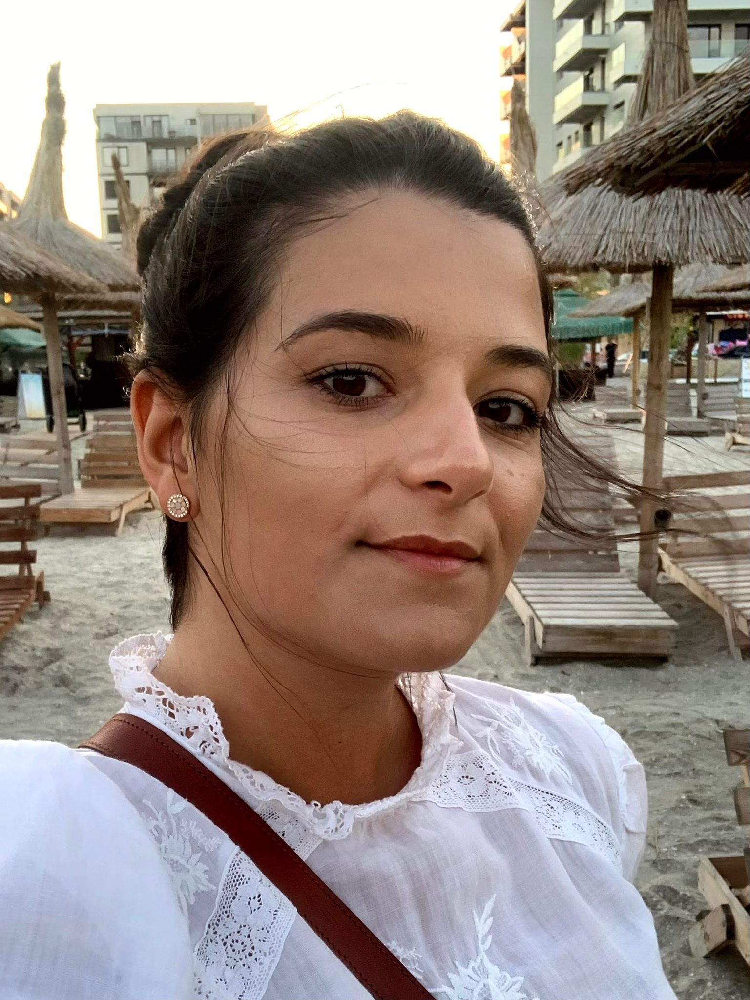

# Project Team

## Liza Babu

Hello!
I'm Liza, I am a contributor to the OpenEdu project (21-COP-0016).
I operate beyond the scenes with ideas to the methodology of the project and I take care of the project overall presentation.

I finished my Masters degree in Advanced Cybersecurity in 2019 at University POLITEHNICA of Bucharest, Romania.
I am also a teaching assistant at University POLITEHNICA of Bucharest, being involved in Computer Programming, Operating Systems and Hardware-Software Interface classes.
I am interested in operating systems, security, low-level programming and a big fan of open source.
I love spending time with students, teaching and finding ways to improve the current education system.

I currently work at [Bitdefender](https://www.bitdefender.com/) as a software engineer, part of the [Connected Home Security](https://www.bitdefender.com/smart-home/) team.

Apart from computer science, I really enjoy skiing, dancing and cooking.