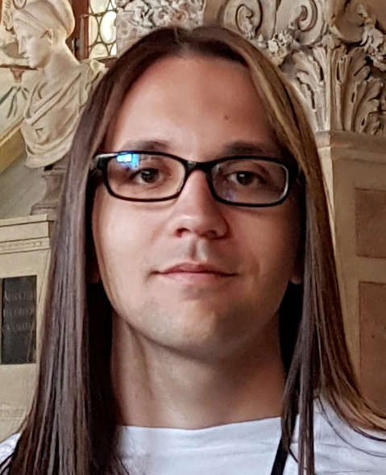

# Project Team

## Teodor Duțu

I am a contributor to the OpenEdu project (21-COP-0016).
I am developing content for the [Operating Systems class](https://github.com/systems-cs-pub-ro/operating-systems-oer/), the [Security Summer School](https://github.com/security-summer-school/), as well as the [D Summer School](https://dlang-upb.github.io/D-Summer-School/).

I am a Masters student at University POLITEHNICA of Bucharest, Romania, enrolled in the Advanced Cybersecurity programme.
I am also a teaching assistant at the University POLITEHNICA of Bucharest, being involved in the Operating Systems, Data Structures and Hardware-Software Interface classes.
I am interested in compilers, programming language analysis, operating systems, security and embedded programming and passionate about open source and I am also a contributor to the [D programming language](https://dlang.org/).

Apart from computer science, I like history, philisophy literature, healthy cooking and running.
