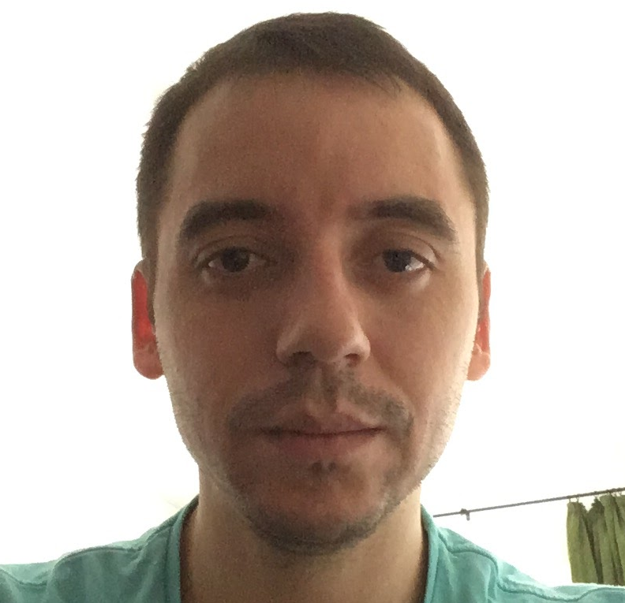

# Project Team

## Răzvan Deaconescu

Hi!
I'm Răzvan, I am the OpenEdu project (21-COP-0016) director.
I supervise project activities and I am engaged in content development for the [Operating Systems class](https://github.com/systems-cs-pub-ro/operating-systems-oer/) and the [Security Summer School](https://github.com/security-summer-school/).
I am in charge of engaging the teaching staff at University POLITEHNICA of Bucharest and other universities and educational institutions in Romania.

I am an Associate Professor at University POLITEHNICA of Bucharest, Romania, the Computer Science and Engineering Department.
I am primarily interested in operating systems and security, with a penchant for teaching and mentoring.
If a class uses "operating systems" as part of its name, it's likely I'm part of the team.
Research-wise I work on software security, particularly [Apple iOS security](https://github.com/malus-security/) and [the Unikraft unikernel](https://unikraft.org/) in recent years.
I am part of the open source and security community in the university and in Romania.
